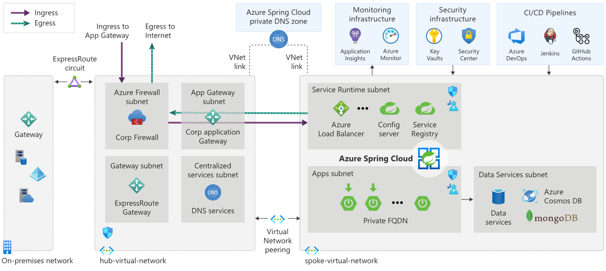
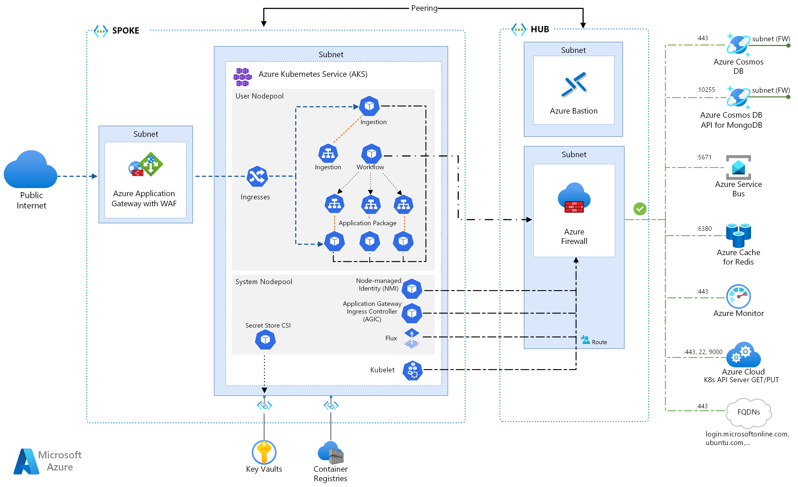
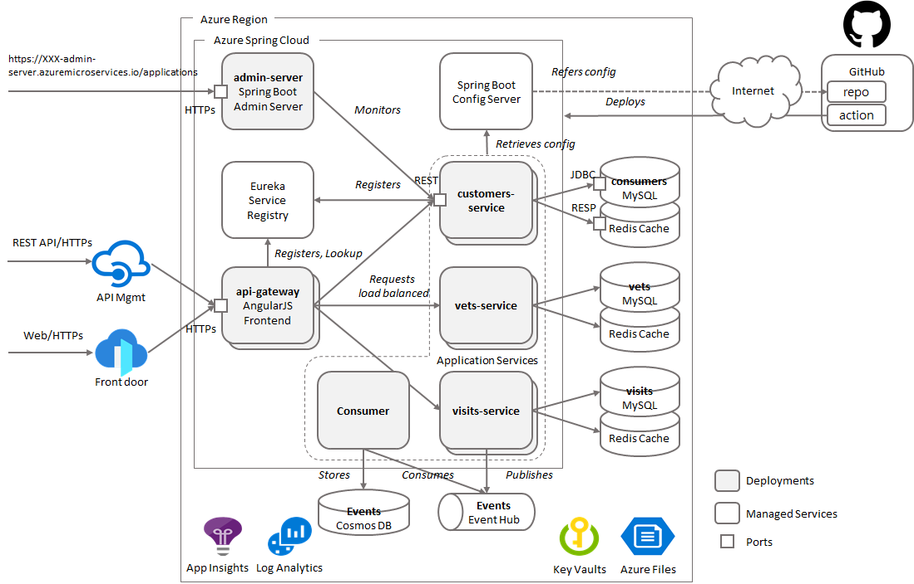

# MOANA Launch

1. 플랫폼선택

   * Only JAVA Spring, 다양한 워크로드 = MSA-Polyglot
   * Spring Cloud 이해(Eureka, Config, Gateway..)
   * ARO → Private Cluster구성과 동일한 관리환경

2. DevOps

   * CI/CD
     * Jenkins / GitHub Action / Azure DevOps
   * Board
     * Jira or Azure DevOps
   * Monitoring / Logging / Alerting
     * Spring Eco(슬루스, 집킨, 그라파나, Prometheus, Acuator, Admin Server, ELK...) vs Azure Native Monitroing
   * IaC
   * IDE

3. 클라우드아키텍처

   * 인프라: Landing zone
   * Endpoint: App GW, Front Door
   * Security: WAF, DDOS
   * 보안: Policy, RBAC, 네트워크 격리
   * 가용성: HA, DR

4. 앱 아키텍처

   * Software Stack
   * 비동기 메시징(Kafka, Service Bus)
   * 분산 db (PaaS or 자체, Redis, CosmosDB, MongoDB in Azure Marketplace)
   * 캐시 Layering
     * data, http, cdn
   * 네트워크 
     * LB: Spring LB, Azure LB
     * Gateway: Spring Cloud Gateway, Azure App GW
   * N tier
     * SSL오프로딩 vs End to End SSL
     * 웹서버 vs Azure Static Web
   * API Management
   * Authentication

5. 후속계획 및 고려사항

   * Upskilling 계획
      * Azure Spring Apps Hands-on
      * Spring app in AKS Hands-on
   * Resilience 설계 / 코드 / 테스트
     * MSA간/내부 Resiliency, PaaS Connection Resiliency
   * 12 Factor App 구현전략(디자인 워크샵 필요)

6. Reference Arhitectures
    * Azure Spring Apps
        
        * https://github.com/Azure-Samples/azure-spring-cloud
        * https://github.com/euchungmsft/spring-petclinic-microservices
    * Spring app in AKS
        
        * https://github.com/azure-samples/java-on-aks
    * Demo Arhiceture
        

